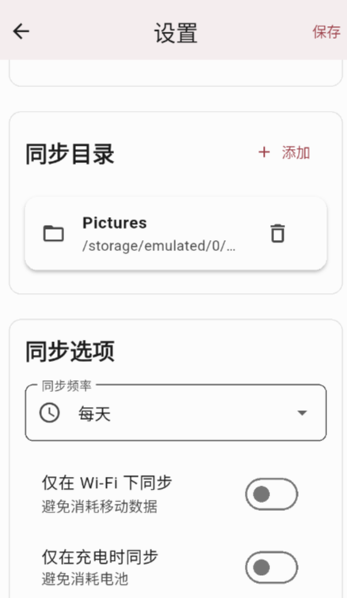
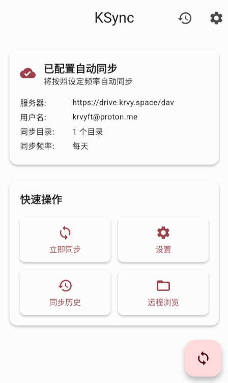
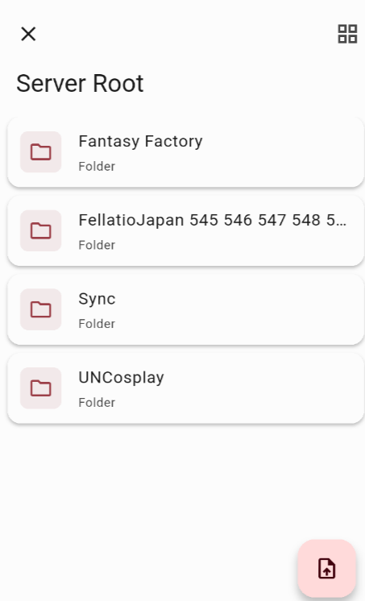

# ksync

一个使用 Flutter 构建的、简洁高效的 Android WebDAV 同步工具。它可以让你轻松地将本地文件夹与你的 WebDAV 服务器保持同步。

## ✨ 主要功能

- **WebDAV 连接**: 安全地连接到任何 WebDAV 服务器 (支持 HTTP/HTTPS)。
- **后台自动同步**: 设置自动同步频率（从每15分钟到每天），或选择手动同步。
- **灵活的同步条件**: 可配置仅在 Wi-Fi、充电时、设备空闲时或电量充足时进行同步，以节省流量和电量。
- **多目录同步**: 选择一个或多个本地目录与云端进行同步。
- **云端文件浏览器**: 直接在应用内浏览、查看你的 WebDAV 服务器上的文件和文件夹。
- **视图模式切换**: 文件浏览器支持列表和网格两种视图模式，方便浏览不同类型的文件。
- **媒体文件预览**: 直接在线预览云端的图片和视频文件。
- **同步日志**: 查看详细的同步历史和日志，方便问题诊断。

## 📸 截图

|            设置页面            | 主页 |        文件浏览器        |
| :-----------------------------: | :--: | :------------------------------: |
||||

## 🚀 开始使用

按照以下步骤来编译和运行本项目：

1. **克隆仓库**

   ```shell
   git clone <你的仓库地址>
   cd ksync
   ```

2. **获取 Flutter 依赖**

   ```shell
   flutter pub get
   ```

3. **运行应用**
   为了获得最佳性能，建议在 release 模式下运行：

   ```shell
   flutter run --release
   ```

## 🛠️ 技术栈

- **框架**: [Flutter](https://flutter.dev/)
- **语言**: [Dart](https://dart.dev/)
- **状态管理**: [flutter_bloc](https://pub.dev/packages/flutter_bloc)
- **后台任务**: [workmanager](https://pub.dev/packages/workmanager)
- **WebDAV 客户端**: [webdav_client](https://pub.dev/packages/webdav_client)
- **本地存储**: [Hive](https://pub.dev/packages/hive) & [flutter_secure_storage](https://pub.dev/packages/flutter_secure_storage)
- **依赖注入**: [get_it](https://pub.dev/packages/get_it)

## 📄 许可证

本项目采用 [MIT 许可证](LICENSE)。请随意使用、修改和分发。
